### 📣 About me
- 👋 Hi, I’m <a href="https://github.com/SUIFENGSK/">@SUIFENGSK</a>
- 🕹️ I’m interested in Software Development, System Development & Web Design
- 🤖 I’m currently studying for a Master of Science (MSc) in Computer Science and Engineering at <a href="https://www.dtu.dk">Technical University of Denmark (DTU)</a>
- 💻 I'm currently working as a Student Assistant in Consulting (Analyst) at <a href="https://www.netcompany.com">Netcompany</a>
- 📫 How to reach me <a href="https://kkmstudio.dk/">KKM-STUDIO</a>

### 📮 Contact me

### ⚡ GitHub Stats & Most Used Languages

<!--
### 🏆 Github Profile Trophy

-->

<!--
### 🔖 Technologies I use

-->
